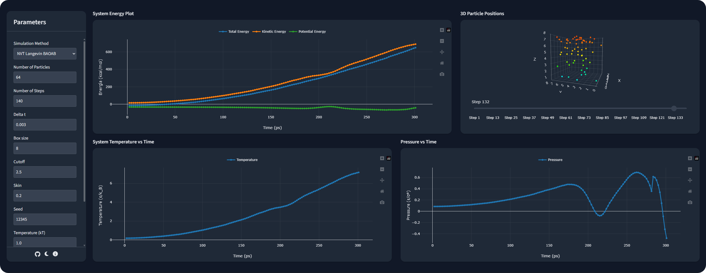

<p align="center">
  
  <span style="font-size: 2em; font-weight: bold; vertical-align: middle;">MC-MD-Simulator</span>
</p>

<p align="center">
Functional prototype of an advanced web platform for Molecular Dynamics (MD) and Monte Carlo (MC) simulations, designed for research in computational physics, theoretical chemistry, and materials science. It combines the performance of Python and Fortran with interactive visualizations in Plotly, allowing detailed analysis of energy, temperature, pressure, particle distributions, and metadynamics biases. The interface provides precise tools for studying complex molecular systems, facilitating both exploration and interpretation of results.
</p>

<p align="center">
  <a href="LICENSE">
    
  </a>
  
  
  
  
  
  
  
  
</p>

<p align="center">
  
  <br>
  <em>View of the interface and basic operation of the prototype.</em>
</p>

## 📂 Project Structure

```text
├── data/                      # Folder containing simulation data and results
│   ├── MuVT_MonteCarlo/       # Data specific to MuVT MC simulations
│   └── NVT_Langevin_BAOAB/    # Data specific to NVT BAOAB simulations
├── fortran/                   # Fortran code for simulations
│   ├── MuVT_MonteCarlo/       # Modular Fortran implementation of MuVT MC
│   │   ├── bin/               # Compiled executables for MuVT MC
│   │   ├── build/             # Object files and compiled modules
│   │   └── modules/           # Fortran source modules for MuVT MC
│   └── NVT_Langevin_BAOAB/    # Non-modular Fortran implementation of NVT BAOAB
│       └── bin/               # Compiled executables for NVT BAOAB
├── python/                    # Python code to control and analyze simulations
└── web/                       # Web interface and frontend scripts

Note: Code contains comments in English and Spanish
```

## 🚀 Instalación

Follow these steps to launch the functional prototype of **MC-MD-Simulator**

#### Option 1: Using Docker Compose
```bash
# Start the environment
docker compose up --build
```
This will build the image and start the mc_md_simulator_container with the Flask service available at 👉 http://localhost:5000

#### Option 2: Using only Docker

```bash
# Build the image
docker build -t mc_md_simulator_image .

# Run the container
docker run -p 5000:5000 --name mc_md_simulator_container mc_md_simulator_image
```
## ⚙️ Technologies

| Category       | Technology | Version |
|----------------------------|------------------------|-----------------|
| 🌐 **Web / Frontend**      | TailwindCSS            | latest          |
|                            | UA-Parser.js           | latest          |
|                            | Plotly.js              | 2.26.1          |
|                            | MathJax                | 4               |
| 🐍 **Python / Backend**     | Python                 | 3.13            |
|                            | Flask                  | 3.1.2           |
|                            | NumPy                  | 2.3.3           |
| ⚙️ **Fortran / Scientific** | gfortran               | 14.2            |
|                            | Estándar Fortran       | 2018            |
| 🐳 **Containers** | Docker / Docker Compose | –           |
| 💾 **Data**         | Binario y JSON         | –               |


## 🧪 Molecular Dynamics

The **Molecular Dynamics (MD)** module of **MC-MD-Simulator** implements 3D simulations of particle systems under **NVT (constant volume and temperature)** conditions using the **Langevin BAOAB integrator** and the **shifted Lennard-Jones 12-6 potential**. It is designed to provide high performance and accuracy for computational studies in physics, chemistry, and materials science.

### Technical Features

- **Interatomic Potential:** Shifted Lennard-Jones 12-6, smoothly truncated at the cutoff to avoid energy discontinuities.  
- **Integrator:** Full BAOAB (Langevin), efficiently combining kick, drift, and thermostat steps in a stable manner.  
- **Parallelization:** Implemented with **OpenMP**, using thread-local arrays and safe reduction for forces and energy.  
- **Neighbor Optimization:** O(n) cell lists for efficient neighbor particle search, ensuring scalability for large systems.  
- **Boundary Conditions:** Periodic in all three directions, applied at each integration step.  
- **Initialization:** Particles positioned on a lattice with random perturbations and velocities generated according to the Maxwell-Boltzmann distribution, ensuring reproducibility via random seeds.  
- **Simulated Properties:** Potential energy, kinetic energy, total energy, interatomic forces, positions, and velocities of all particles.  
- **Output Format:** Binary files for efficient storage of simulation frames, suitable for post-processing and interactive visualization.  
- **Computational Efficiency:** Vectorized and parallelized force calculations, suitable for systems with tens of thousands of particles.  
- **Compatibility:** Algorithms prepared for any number of particle types, with precomputed interaction matrices (`sigma^6` and `epsilon`) for Lennard-Jones.

### Simulation Flow

1. **Parameter Reading:** Number of particles, simulation steps, timestep, simulation box, cutoff, skin, temperature, and friction.  
2. **System Initialization:** Assignment of particle masses and types, initial lattice configuration with random perturbations, computation of interaction matrices.  
3. **Cell List Construction:** Preparation of neighbor structures for efficient force computation.  
4. **Time Integration:** Langevin BAOAB step, combining drift, kick, and thermostat with reproducible thermal noise generation in parallel.  
5. **Force Calculation:** Pairwise forces using Lennard-Jones and cell lists, with energy shift correction.  
6. **Energy Calculation:** Kinetic, potential, and total energy, reduced in parallel for consistency across threads.  
7. **Data Output:** Writing complete frames (positions, velocities, forces, energy) in binary format.  
8. **Finalization:** Closing files and releasing dynamic memory.

## 🎲 Monte Carlo μVT Simulation

The **Monte Carlo (MC)** module of **MC-MD-Simulator** enables simulations in the **μVT (grand-canonical) ensemble** with optional **Metadynamics** or **Umbrella Sampling** biasing. It focuses on efficiency and reproducibility of particle simulations, providing control over energy, density, and acceptance rates of moves.

### Technical Features

- **Ensemble:** Grand-canonical μVT (variable Number of particles, Volume, and Temperature, chemical potential μ).  
- **Monte Carlo Moves:**  
  - Particle displacement  
  - Particle insertion  
  - Particle deletion  
- **Acceptance Criterion:** Standard Metropolis, automatically adjusting the maximum displacement (`max_disp`) to maintain an optimal acceptance rate (~50%).  
- **Optional Bias:**  
  - Metadynamics: Gaussian bias on the average x-coordinate  
  - Umbrella Sampling: applied using `k_bias` and `xi_target`  
- **Replica Exchange Monte Carlo (REMC):** Support for multiple replicas with configuration exchanges between different temperatures.  
- **Random Number Generation:** RNG initialized with configurable seed, ensuring reproducibility.  
- **Parallelization:** Loops parallelized (`OpenMP`) for energy calculation and bias updates, ensuring efficiency for large systems.  
- **Output Format:** Binary files including positions, total energy, density, maximum displacement, and bias parameters if active.  
- **Dynamic Control:** Periodic adjustment of maximum move steps (`max_disp`) and recording of acceptance statistics.

### Simulation Flow

1. **Parameter Reading:** Number of particles, volume, temperature, chemical potential, simulation steps, and optional bias parameters.  
2. **System Initialization:** Particle configuration, volume, temperature, chemical potential, and RNG setup.  
3. **Bias Configuration:** Initialize Metadynamics or Umbrella Sampling if requested.  
4. **Main Monte Carlo Loop:**  
   - Random selection of move (displace, insert, delete)  
   - Energy calculation and acceptance/rejection according to Metropolis  
   - Update system positions and energy  
   - Apply Metadynamics bias if active  
5. **Dynamic Adjustment:** Periodic adjustment of `max_disp` to maintain adequate acceptance rates.  
6. **Statistics Recording:** Acceptance rates of moves, insertions, and deletions both per window and cumulative.  
7. **Replica Exchange (optional):** Exchange configurations between replicas using the Metropolis criterion.  
8. **Data Output:** Write positions, energy, density, and bias parameters to binary files.